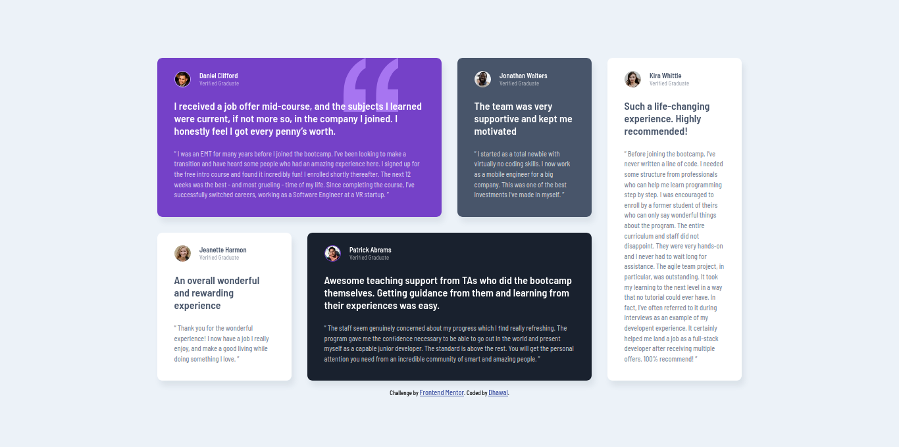

# :star2: Frontend Mentor - Testimonials grid section :star2:

This is a solution to the [Testimonials grid section challenge on Frontend Mentor](https://www.frontendmentor.io/challenges/testimonials-grid-section-Nnw6J7Un7). Frontend Mentor challenges help you improve your coding skills by building realistic projects. 

### :point_right: [Live Site](https://dhawalrath.github.io/testimonial-grid-section/)

## :camera: Overview

## :muscle: Built With

- HTML5 Semantics
- SCSS
- CSS3 (with Grid and Flexbox)
- Media Queries (for Mobile design)

## :man: Author

- Frontend Mentor - [@dhawalRath](https://www.frontendmentor.io/profile/dhawalRath)
- Twitter - [@dhawalRath](https://www.twitter.com/dhawalRath)

